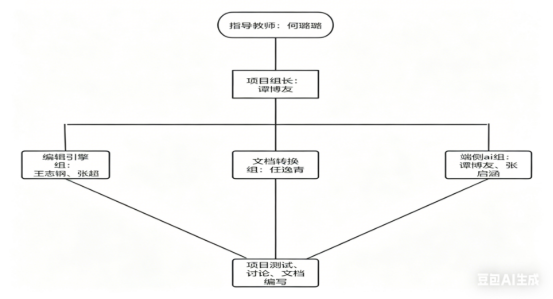
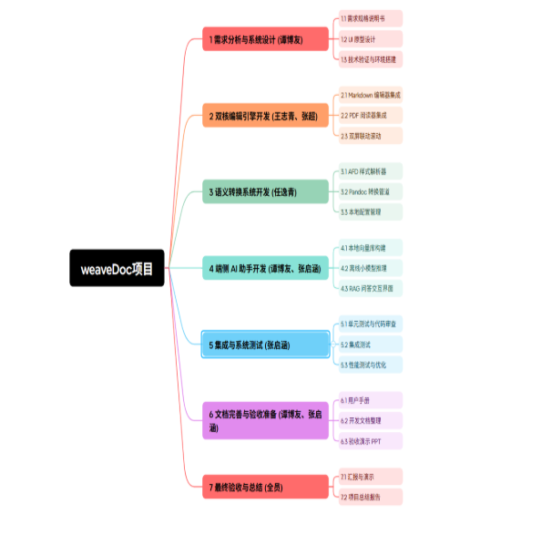
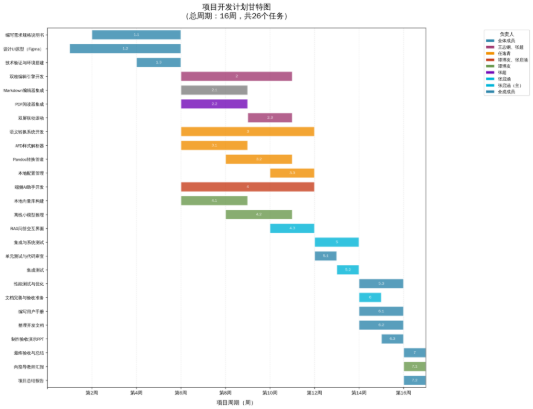
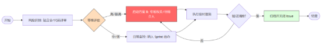

# 《软件计划项目书》

## 1. 引言

### 1.1 编写目的

本文档旨在明确"WeaveDoc"软件项目计划书的编写目的与核心用途，为项目的顺利开展提供纲领性指导。本文档详细规划了项目的开发周期、人员分工、技术选型及风险控制策略，明确文档的预期读者如下：

- **指导教师与验收评审人员**：用于全面评估项目技术方案的可行性、进度安排的合理性，并作为各阶段审查及最终验收的核心依据。
- **项目团队成员**：作为开发全生命周期的执行大纲，帮助团队统一产品愿景，明确个人职责与阶段性目标，指导项目从立项到最终交付的顺利实施。

### 1.2 项目背景

在当前的学术研究与高校学习场景中，研究人员和学生在论文写作与文献阅读环节面临着显著的痛点。现有的学术工作流通常需要在传统的 PDF 阅读器、学习门槛极高的 LaTeX（或排版繁琐的 Word）以及网页端 AI 工具之间频繁切换。这种割裂的工作流不仅效率低下，且高度依赖云端的 AI 工具容易带来学术数据和未发表成果泄露的隐私风险。

本项目提出的"WeaveDoc"致力于打造一个本地优先的学术工作台，其提出的必要性在于彻底解决学术排版的"最后1公里"难题与端侧 AI 的安全协同问题。项目的应用领域聚焦于学术文献阅读、结构化写作与知识管理，主要服务对象为理工科专业学生、高校科研人员及技术开发者。通过引入"格式即代码（Format as Code）"理念与离线小语言模型（SLMs）驱动的 RAG 文献问答，本项目的实施将大幅降低复杂学术论文的排版门槛，并在完全离线的环境下保障文献数据的绝对安全，具有极高的工程实践与现实应用价值。

### 1.3 任务来源

本项目作为软件工程实践的重要组成部分，立足于真实的学术痛点与需求。

- **发起主体：**武汉大学计算机学院软件工程课程实践项目。
- **指导单位/人员：**何璐璐（软件工程课程老师）。
- **任务要求：**在规定的开发周期内，由五人团队协作，采用敏捷开发模式，完成一个具备 Markdown 双屏联动编辑、PDF 实时解析、模板化格式导出及本地离线 AI 辅助阅读功能的桌面端软件产品。
- **核心目标导向：**打造一个高可用、本地化、重隐私的最小可行性产品（MVP），跑通从"文献阅读"到"符合格式规范导出"的业务闭环，并严格按照软件工程规范产出全套项目管理与技术文档。

### 1.4 参考标准与资料

列本项目计划书的编写以及后续软件生命周期管理，主要依据以下软件行业国家标准、规范及相关参考资料：

- **行业国家标准：**严格遵循 GB/T 8567-2006《计算机软件文档编制规范》执行文档编写与交付。
- **项目与课程资料：**《软件项目计划书》参考模板、《软件工程》教材。
- **技术规范与开发文档：**
  - Avalonia UI / .NET 9/10 官方桌面端开发手册
  - Monaco Editor 核心文档及 Markdown 语法标准
  - Pandoc 文档转换引擎官方指南与 AST 规范
  - LLamaSharp 离线大语言模型推理框架集成文档
- **同类项目案例参考：**MarkText、Stirling-PDF 等同类学术与笔记工具的功能白皮书与产品分析报告以及相关产品说明文档。

## 2. 项目概述

### 2.1 项目范围

本项目旨在开发一款名为 WeaveDoc 的本地化智能学术工作台，旨在通过"格式即代码"的理念简化论文写作流程。

- **核心服务对象：**高校本科生、研究生及初级科研人员。
- **覆盖场景：**学术论文初稿撰写、课程报告排版、多源文献阅读笔记、离线学术资料检索。
- **功能范围：**支持 Markdown 与 PDF 的双屏联动；提供基于本地 JSON 模板（AFD 协议）的 Word/PDF 高保真导出；集成端侧小模型实现文献自动摘要与 RAG 问答。
- **项目边界（不涵盖内容）：**不包含云端多人实时协作、不涉及第三方商业引文库的实时付费采集、不包含针对印刷出版级的复杂排版校验。

### 2.2 主要功能

项目将功能划分为四大核心模块，确保学术写作全流程的闭环：

**表2.2.1 WeaveDoc核心功能模块**

| **模块名称** | **核心作用** | **关键子功能** | **核心价值路径** |
| :-: | :-: | :-: | :-: |
| **双核编辑引擎** | 提供沉浸式写作环境 | MD 语法高亮、数学公式实时渲染、PDF 按滚动比例同步（MVP） | 消除阅读与写作之间的应用切换成本 |
| **语义转换系统** | 实现样式与内容分离 | 样式解析器（AFD）、Pandoc 转换管道、OpenXML 样式映射 | 解决学术排版"最后 1 公里"的格式调整难题 |
| **端侧 AI 助手** | 保护隐私的智能辅助 | 本地向量库构建、长文本语义切片、离线小模型推理 | 在完全离线环境下实现文档级深度问答 |
| **本地配置管理** | 统一管理学术资源 | BibTeX 文献索引、样式库管理、版本增量快照 | 确保存档资料的结构化与可追溯性 |

### 2.3 性能要求

明为确保软件在学生群体主流配置电脑上流畅运行，设定以下量化指标：

- **响应速度：**
  - 软件冷启动时间不超过 5 秒。
  - Markdown 编辑器万字长文打字延迟不超过 30 毫秒。
  - 100MB 以内 PDF 首屏渲染时间不超过 3 秒；全文文本解析与索引在后台异步完成，用户可在解析期间正常浏览与滚动。
- **AI 推理性能：**在 16GB 内存（无显卡加速）环境下，离线模型推理速度不少于 2 tokens/s。
- **数据一致性：**导出 docx 需满足模板定义的关键样式项（标题层级、正文、引用、页边距、字体字号、行距、段前段后）一致率不低于 95%；一致率计算方式为：在标准样册中抽取 20 项关键样式，至少 19 项正确匹配。
- **跨平台兼容性：**优先适配 Windows 10/11 (x64)，兼容主流 Linux 发行版（如 Ubuntu 24.04 LTS）。
- **安全性：**所有文献数据及 AI 处理过程均在本地完成，不产生任何非用户授权的外部网络通信。

### 2.4 主要参与方

本项目由五人团队协作完成，具体职责分工如下：

**表2.4.1 主要参与方以及关键职责、协作关系**

| **角色定位** | **核心成员** | **关键职责** | **协作关系** |
| - | - | - | - |
| **项目组长** | 谭博友 | 负责核心状态机管理与接口契约定义；统筹项目进度、版本发布及外部沟通。 | 统筹全局，连接解析层与渲染层，确保数据流转一致。 |
| **编辑引擎开发岗** | 王志钢、张超 | 负责 Monaco Editor 的深度学习与移植、Markdown 渲染及 PDF 阅读器的 UI 集成；实现双屏同步滚动逻辑。 | 与组长协作完成编辑器状态映射，为 AI 助手提供交互入口。 |
| **文档转换开发岗** | 任逸青 | 负责 AFD 协议解析、Pandoc 转换管线调教及 OpenXML 样式映射；管理本地配置与 BibTeX 索引。 | 接收组长的 IR 数据，根据用户选择的模板输出高保真文档。 |
| **AI 与算法岗** | 谭博友、张启涵 | 负责端侧小模型的量化部署（LLamaSharp）；构建本地向量数据库（RAG）；实现语义摘要与问答接口。 | 为编辑器提供异步语义支持，与编辑组协作实现流式结果展示。 |
| **质量与配置岗** | 张启涵为主，其他人辅助 | 负责自动化测试用例编写、Git 工作流监控及 GitHub CodeQL 代码质量审计；主导文档的排版与合规检查。 | 监督各模块代码质量，确保交付物符合 GB/T 8567-2006 标准。 |

### 2.5 实施环境

本项目的开发与运行环境配置如下：

#### 2.5.1 软件开发环境

- **开发语言与框架：**C# (.NET 9/10), Avalonia UI。
- **核心库：**PDFium (PDF 解析), LLamaSharp (AI 推理), Markdig (MD 处理), SQLite (数据存储)。
- **工具链：**Visual Studio 2022 / JetBrains Rider, Git (版本控制), Pandoc (转换内核)。

#### 2.5.2 硬件及网络环境

- **最低配置：**8GB RAM, 支持 AVX2 指令集的 CPU。
- **推荐配置：**16GB RAM, 具备 6GB 以上显存的独立显卡（用于 AI 加速）。
- **网络要求：**仅在安装依赖及初次下载大模型文件时需要网络，日常开发与运行全离线。

## 3. 组织结构与职责分配

### 3.1 项目组织架构

本项目采用扁平化组织架构，由课程指导教师提供方向指导，项目组长统筹协调，下设三个技术小组分别负责核心模块开发。具体组织架构如下：

图3.1.1 组织架构图

### 3.2 关键角色及职责分配

项目中的关键角色，以及它们的具体职责、工作范围如以下表格所示：

**表3.2.1 关键角色以及职责分配表**

| **角色** | **姓名** | **职责范围** | **工作内容说明** |
| :-: | :-: | :-: | :-: |
| **指导教师** | 何璐璐 | 项目方向指导、阶段审查、资源协调 | 定期检查项目进度，提供技术方向建议，参与里程碑评审 |
| **项目组长** | 谭博友 | 整体统筹、进度管理、对外沟通、制定规则 | 制定项目计划，组织会议，协调组内分工、负责 Document IR 与核心状态管理；定义模块间数据接口契约。 |
| **编辑引擎组** | 王志钢、张超 | 双核编辑引擎开发与集成 | 实现 Markdown 编辑器（语法高亮、公式渲染）、PDF 阅读器及双屏联动滚动功能 |
| **语义及文本转换组** | 任逸青 | 语义转换系统、本地配置管理、文档转换 | 开发 AFD 样式解析器、Pandoc 转换管道、OpenXML 样式映射，管理 BibTeX 文献和模板库 |
| **端侧 AI 组** | 谭博友、张启涵 | 端侧 AI 助手开发 | 构建本地向量库，实现长文本切片、离线小模型推理及 RAG 问答接口 |
| **质量测试组** | 张启涵（主要），其他成员（协助） | 质量保证，文档筛查排版 | 编写测试用例，执行代码审查，管理 Git 仓库与版本控制，审核文档格式 |

> 以上表格仅代表早期分工，仅供参考，随着项目进行，具体分工可灵活变动。

### 3.3 团队协作机制

- **沟通方式：**使用 QQ 群进行日常沟通，重要技术讨论迁移至 GitHub Issues 或飞书文档。每周二、五 20:00 召开 15 分钟站立会议，同步进度与障碍。
- **会议制度：**每两周召开一次项目例会（时长 1 小时），评审里程碑成果，调整下阶段计划。会议纪要由项目组长整理并归档至项目仓库。
- **版本控制：**采用 Git + GitHub 进行代码管理，分支策略为 Git Flow：main 分支存放稳定发布版，develop 分支集成开发，功能分支命名格式为 feature/模块名-功能描述。
- **任务管理：**使用 Trello 看板（或飞书任务）管理 WBS 任务，列分为"待办""进行中""待审查""已完成"。每个任务关联负责人和截止日期。
- **文档协作：**使用腾讯文档或飞书文档协同编写计划书、设计文档，最终统一导出为 Markdown 存入代码仓库的 docs 目录。

## 4. 工作分解结构（WBS）

### 4.1 项目开发周期

本项目总开发周期为 16 周，计划从 2026 年 3 月 2 日开始，至 2026 年 6 月 20 日结束。整体划分为五个阶段：

- **第 1 阶段：**需求分析与系统设计（第 1–5 周，3.2 – 4.5）
- **第 2 阶段：**核心模块开发（第 6–11 周，4.6 – 5.16）
- **第 3 阶段：**集成与系统测试（第 12–13 周，5.17 – 5.31）
- **第 4 阶段：**文档完善与验收准备（第 14–15 周，6.1 – 6.13）
- **第 5 阶段：**最终验收与总结（第 16 周，6.14 – 6.20）

### 4.2 任务分解表

以下表格列出了具体可执行的子任务，明确每个子任务的负责人、起止时间、任务说明，确保任务可管理、可控制。具体的任务分配可能根据实时情况及时调整，可能与以下表格有较大差异：

**图4.2.1 任务分解表**

| **编号** | **任务名称** | **负责人** | **时间** | **说明** |
| :-: | :-: | :-: | :-: | :-: |
| **1** | 需求分析与系统设计 | 谭博友 | 第1-5周 | 完成需求调研、UI原型、技术选型与验证 |
| **1.1** | 编写需求规格说明书 | 全体成员 | 第2-5周 | 细化功能点，绘制用例图，撰写需求文档 |
| **1.2** | 设计UI原型（Figma） | 全体成员 | 第1-5周 | 设计主界面、编辑器布局、AI对话窗口 |
| **1.3** | 技术验证与环境搭建 | 全体成员 | 第4-5周 | 安装.NET 9/10、Avalonia UI，验证Monaco Editor借鉴学习和LLamaSharp可行性 |
| **2** | 双核编辑引擎开发 | 王志钢、张超 | 第6–10周 | 实现MD/PDF双屏联动核心功能 |
| **2.1** | Markdown编辑器集成 | 王志钢 | 第6–8周 | 学习移植Monaco Editor，实现语法高亮、数学公式渲染（KaTeX） |
| **2.2** | PDF阅读器集成 | 张超 | 第6–8周 | 集成Avalonia UI的PDF控件，实现加载、缩放、滚动 |
| **2.3** | 双屏联动滚动 | 王志钢、张超 | 第9–10周 | 实现滚动比例同步与页码同步；若PDF存在目录（Outline），支持章节跳转同步定位。 |
| **3** | 语义转换系统开发 | 任逸青 | 第6–11周 | 完成样式解析与格式导出 |
| **3.1** | AFD样式解析器 | 任逸青 | 第6–8周 | 解析JSON模板中的样式定义（字体、行距、边距） |
| **3.2** | Pandoc转换管道 | 任逸青 | 第8–10周 | 调用Pandoc将MD转换为Word/PDF，保留样式映射 |
| **3.3** | 本地配置管理 | 任逸青 | 第10–11周 | 实现BibTeX文献库导入、样式模板增删改查 |
| **4** | 端侧AI助手开发 | 谭博友、张启涵 | 第6-11周 | 实现离线RAG问答与摘要 |
| **4.1** | 本地向量库构建 | 谭博友 | 第6-8周 | 采用轻量Embedding模型生成向量（如bge-small/miniLM类），向量存储使用SQLite；LLamaSharp负责GGUF模型推理。 |
| **4.2** | 离线小模型推理 | 谭博友 | 第8-10周 | 默认采用3B级轻量模型（如Phi系列或同等规模模型）进行本地推理，预留模型配置能力（配置文件切换），默认提供1个推荐模型，其他模型作为高级扩展。 |
| **4.3** | RAG问答交互界面 | 张启涵 | 第10-11周 | 开发侧边栏对话窗口，展示问题和答案流式输出 |
| **5** | 集成与系统测试 | 张启涵（主） | 第12-13周 | 各模块联调，执行测试用例，修复Bug |
| **5.1** | 单元测试与代码审查 | 全体成员 | 第12周 | 各模块自测，交叉审查代码 |
| **5.2** | 集成测试 | 张启涵 | 第13周 | 端到端测试写作→导出→问答流程 |
| **5.3** | 性能测试与优化 | 全体成员 | 第14-15周 | 按2.3节性能要求测试，优化冷启动、PDF加载速度 |
| **6** | 文档完善与验收准备 | 张启涵 | 第14周 | 整理技术文档、用户手册，准备验收演示 |
| **6.1** | 编写用户手册 | 全体成员 | 第14-15周 | 撰写安装指南、功能操作说明 |
| **6.2** | 整理开发文档 | 全体成员 | 第14–15周 | 汇总设计文档、API说明、测试报告 |
| **6.3** | 制作验收演示PPT | 全体成员 | 第15周 | 包含项目背景、功能演示、创新点 |
| **7** | 最终验收与总结 | 全体成员 | 第16周 | 提交全部交付物，项目复盘 |
| **7.1** | 向指导教师汇报 | 谭博友 | 第16周 | 演示软件，提交文档 |
| **7.2** | 项目总结报告 | 全体成员 | 第16周 | 撰写经验教训、工作量统计 |

### 4.3 WBS层级结构图

WBS层级结构图如下，能清晰呈现项目任务的层级关系、分解逻辑：

图4.3.1 WeaveDoc项目WBS层级结构图

## 5. 项目进度安排

### 5.1 阶段划分与时间安排

详细说明各项目阶段的名称、时间周期、核心任务，明确各阶段的衔接关系，确保进度规划科学合理。以下是项目的阶段划分与时间安排表。

**表5.1.1 项目阶段划分与时间安排表**

| **阶段名称** | **时间周期** | **核心任务** | **产出物** |
| :-: | :-: | :-: | :-: |
| **需求分析与设计** | 第1-5周（3.2–4.5） | 完成需求调研、技术选型 | 需求规格说明书、技术架构文档 |
| **核心模块开发** | 第6-10周（4.6–5.16） | UI原型、并行开发编辑引擎、语义转换、AI助手 | 各模块可运行代码、单元测试报告、UI原型图 |
| **集成与系统测试** | 第11–13周（5.17–5.31） | 模块联调、性能测试、Bug修复 | 集成测试报告、性能测试报告 |
| **文档与验收准备** | 第14–15周（6.1–6.14） | 编写用户手册、整理文档、准备演示 | 用户手册、开发文档、验收PPT |
| **最终验收与总结** | 第16周（6.15–6.20） | 向指导教师演示、提交全部交付物 | 验收签收单、项目总结报告 |

### 5.2 甘特图

项目甘特图如下：

图5.2.1 项目甘特图

### 5.3 项目关键里程碑

项目关键里程碑如下表所示：

**表5.3.1 项目关键里程碑**

| **里程碑编号** | **里程碑名称** | **预计达成时间** | **判定标准** |
| :-: | :-: | :-: | :-: |
| **M1** | 需求与设计评审通过 | 第5周周五（4.5） | 需求规格说明书获指导教师认可，UI原型无重大遗漏 |
| **M2** | 核心模块Alpha版本发布 | 第9周周五（5.3） | 可完成：打开PDF → Markdown记录 → 导出docx → 对PDF进行一次摘要问答。 |
| **M3** | 系统集成测试通过 | 第12周周五（5.24） | 所有测试用例通过率不低于95%，性能指标达到2.3节要求 |
| **M4** | 验收文档完整提交 | 第15周周五（6.14） | 用户手册、开发文档、测试报告、PPT全部完成并审核通过 |
| **M5** | 项目最终验收 | 第16周周五（6.20） | 现场演示通过，指导教师签署验收意见 |

### 5.4 项目进度控制机制

为保证项目按计划推进，团队将采用以下控制措施：

- **周报制度：**每周六前，每位成员填写《个人周报》（包含完成工作、下周计划、风险点），由项目组长汇总后发送指导教师。
- **燃尽图跟踪：**每周末更新 Trello 看板任务完成情况，生成燃尽图，对比计划与实际进度。
- **偏差预警：**若某任务延迟超过 2 天，负责人需在站立会议说明原因并提出追赶方案；若延迟超过 1 周，项目组长启动应急措施（如内部人力调配或简化次要功能）。
- **里程碑评审：**每个里程碑达成后召开评审会，若未通过则制定补救计划并在下一周内补测。
- **版本冻结：**第 12 周起，develop 分支进入功能冻结状态，仅允许修复 Bug，禁止新增功能。
- **沟通同步：**每周二、五站立会议确保进度透明，每双周例会进行阶段复盘。

## 6. 资源与成本估算

### 6.1 人力资源估算

本项目开发周期共计 16 周，团队由 5 名核心成员组成。人力资源投入主要依据各阶段任务强度进行动态分配，估算单位为"人·天"（按每周人均投入 20 小时/2.5 个标准工作日计算）。

**表6.1.1 人力资源估算表**

| **资源类别** | **岗位/角色** | **人数** | **预计投入工时(h)** | **备注** |
| - | - | - | - | - |
| **内部人员** | 项目组长 | 1 | 320 | 16 周 × 20 小时/周 |
| **内部人员** | 编辑引擎开发工程师 | 2 | 640 | 16 周 × 20 小时/周 × 2 人 |
| **内部人员** | 文档转换开发工程师 | 1 | 320 | 16 周 × 20 小时/周 |
| **内部人员** | AI 与质量工程师 | 2 | 320 | 16 周 × 20 小时/周 |
| **合计** | - | **5** | **1600** | - |

### 6.2 硬件与设备资源

**表6.2.1 硬件与设备资源清单**

| **设备名称** | **数量** | **配置/规格要求** | **用途说明** |
| - | - | - | - |
| **个人开发工作站** | 5台 | CPU: 支持AVX2指令集；RAM: 16GB及以上 | 代码编写、局部编译与调试 |
| **AI 推理测试机** | 2台 | GPU: RTX 3060(6GB)及以上（或M系列芯片Mac） | 离线模型量化测试、RAG性能压力测试 |
| **移动存储设备** | 5件 | 高速USB 3.0 / SSD (256GB+) | 离线模型文件（数GB级）的备份与分发 |

### 6.3 软件与开发工具

本项目坚持开源与教育免费授权优先原则，最大限度降低软件采购成本。

**表6.3.1 软件和开发工具清单**

| **工具分类** | **名称** | **授权情况** | **用途说明** |
| - | - | - | - |
| **集成开发环境** | Visual Studio 2022 / Rider | Community / Student | C#核心代码与Avalonia视图开发 |
| **核心框架/库** | .NET 9/10, Avalonia UI, LLamaSharp | MIT / Apache 2.0 | 系统底层架构与AI推理支撑 |
| **转换与处理引擎** | Pandoc, PDFium | GPL / BSD | 文档格式转换与PDF底层解析 |
| **协作管理工具** | GitHub, Trello, GitHub CodeQL | Free Plan | 版本控制、WBS管理与代码质量扫描 |
| **办公文档工具** | 飞书/腾讯文档, LaTeX | Free | 计划书、设计说明书等产研文档编写 |

### 6.4 项目预算估算汇总

考虑到本项目为软件工程课程实践项目，财务预算主要分为"影子人力成本"与"实际支出"两部分。

**表6.4.1 项目预算估算表**

| **费用项** | **估算金额 (RMB)** | **核算标准说明** |
| - | - | - |
| **人力成本 (虚拟)** | ¥80,000.00 | 按初级软件工程师平均时薪 (50 元/h) × 总工时估算 |
| **硬件损耗/折旧** | ¥2,500.00 | 5 台电脑开发期间的电力、折旧及维护分摊 |
| **云服务与 API** | ¥200.00 | 少量在线接口测试费（用于初期性能对标测试） |
| **总计** | ¥82,700.00 | 含虚拟人力成本；实际现金支出预计不超过 ¥200.00 |

### 6.5 结论与价值说明

#### 6.5.1 资源与成本估算的合理性

本项目 (WeaveDoc) 的资源配置与成本估算基于"轻资产、重技术、本地化"的敏捷开发原则，其合理性体现在以下三个维度：

- **人力负载平衡：**总计 200 人·天的工时分配严格对应 WBS 任务权重。核心引擎与 AI 逻辑占用 40% 的工时，确保了技术壁垒的构建；UI 与 IO 模块的等比例投入则保障了产品的可用性。
- **硬件利用的最大化：**项目充分利用成员现有的高性能开发终端，避免了昂贵的服务器购置与 GPU 云端算力租凭费用，符合学生团队的实际财务能力。
- **软件生态协同：**选用 .NET 9/10、Avalonia UI 及 LLamaSharp 等均为开源或学生免费授权协议，不仅消除了版权风险，且这些成熟的工业级框架大幅降低了重复造轮子的成本，使有限的人力能集中于学术解析算法这一核心逻辑。

#### 6.5.2 投入产出价值分析

- **极高的效费比：**项目实际现金支出仅为 200 元（仅用于初期性能对标的 API 调用），但产出的是一个集成了端侧大模型、高保真排版引擎和结构化写作环境的复杂软件系统。相比商业同类产品，本项目的研发成本几乎压缩到了极致。
- **知识资产沉淀：**除软件代码外，项目还将产出全套符合 GB/T 8567-2006 标准的开发文档、AFD 样式协议规范以及本地化 RAG 实施方案。这些资产为后续学术工具的迭代提供了坚实的工程基础。

#### 6.5.3 实践意义与社会价值

- **填补学术隐私空白：**在 2026 年学术数据安全日益受到重视的背景下，WeaveDoc 通过"全离线运行"解决了学生和科研人员担心论文草稿被云端 AI 收集的痛点，具有极强的现实应用意义。
- **解决排版"最后1公里"难题：**通过"格式即代码"的设计理念，将复杂的 LaTeX 或 Word 格式调整简化为自动化的模板映射，能显著提升学术生产力，降低跨学科学生的写作门槛。
- **软件工程全链条锻炼：**对团队成员而言，本项目不仅是代码编写，更是一次从需求分析、架构设计到质量保证的完整工程闭环实践。通过解决 C# 跨平台渲染、端侧大模型量化等前沿技术课题，培养了具备解决复杂工程问题能力的复合型人才。

## 7. 项目风险分析与应对策略

### 7.1 风险识别与评估

**表7.1.1 风险识别与评估机制表**

| **风险类别** | **风险项说明** | **发生概率** | **影响程度** | **风险等级** |
| - | - | - | - | - |
| **技术风险** | PDF 复杂布局解析失败：学术论文的多栏、图表嵌套导致 IR 转换丢失结构。 | 高 | 严重 | 极高 |
| **技术风险** | 本地 AI 推理性能瓶颈：16GB 内存下 LLM 响应过慢，影响 RAG 问答体验。 | 中~高 | 中~严重 | 中 |
| **进度风险** | 核心 IR 开发进度滞后：中间表示层设计过于复杂，导致前后端联调延期。 | 中 | 严重 | 高 |
| **协作风险** | 环境配置不一致：Avalonia 或 LLamaSharp 依赖库在不同操作系统下出现兼容性问题。 | 低 | 中等 | 低 |
| **质量风险** | 导出格式偏差：生成的 Word/PDF 与 AFD 模板在极端排版下出现像素级偏移。 | 中 | 严重 | 高 |

### 7.2 应对策略与预警机制

针对上述识别出的风险，制定具体的应对措施与预警触发条件：

#### 7.2.1 技术风险应对

- **PDF 解析优化：**采用"分级解析策略"。若深度布局分析失败，自动降级为"文本流+坐标提取"模式，确保内容不丢失。预警：若单页解析超过 5 秒，触发解析算法降级。降级模式下可保证文本不丢失，并提供页码级/滚动比例级联动。
- **AI 性能优化：**引入 GGUF 多级量化模型（如 4-bit 量化）。预警：若推理速度低于 2 tokens/s，自动切换至更轻量的模型或缩减上下文窗口。

#### 7.2.2 进度与协作应对

- **关键路径监控：**将"IR 数据结构定义"设为最高优先级。**预警机制：**若 Trello 看板中"进行中"任务停滞超过 3 天，项目组长立即介入，评估是否进行功能裁剪（MVP 原则）。
- **统一开发镜像：**使用 Git LFS 管理大型模型文件，并提供统一的 .NET SDK 配置文件，确保跨平台环境一致性。

#### 7.2.3 质量风险应对

- **视觉对比测试：**建立"标准样册测试集"，每次导出后进行自动化的视觉差异检测。预警：若关键样式（标题、引用）丢失，强制阻断版本合并。

### 7.3 风险控制流程图

#### 7.3.1 风控流程图

图7.3.1.1 风控流程图

#### 7.3.2 流程图逻辑说明

该图表展示了 WeaveDoc 项目组在处理突发风险时的标准流转路径，核心逻辑分为四个步骤：

1. **多渠道识别：**团队在**站立会议**汇报或**代码评审**（Code Review）过程中，捕捉可能影响进度或质量的潜在问题。
2. **分级响应：**
   - **(1) 高/极高风险：**若涉及核心架构或重大技术卡点，立即启动**方案 B**，进行专项攻关并请求导师介入指导。
   - **(2) 中/低风险：**若为一般性 Bug 或非关键路径延期，将其纳入**Sprint 待办事项**，随日常开发解决。
3. **执行与迭代验证：**执行应对措施后进行**效果验证**。若风险未彻底消除，则回溯至方案 B 阶段重新调整策略。
4. **闭环归档：**确认风险消除后，在 GitHub 平台**关闭相关 Issue** 并同步更新技术文档，确保经验可追溯。

## 8. 质量保证计划（SQA Plan）

### 8.1 质量目标

本项目（WeaveDoc）的质量目标具体、可量化，旨在确保交付的软件产品满足学术场景需求，并符合软件工程课程实践要求：

1. **功能完整性目标：**确保核心业务闭环 100% 可用（打开PDF - 写MD - 导出docx - AI摘要问答），非核心增强功能允许降级或延期。
2. **性能达标目标：**100% 满足 2.3 节设定的量化性能指标，包括：
   - 冷启动时间不高于 5 秒。
   - 万字 Markdown 编辑延迟不高于 30 毫秒。
   - 100MB 以内 PDF 首屏渲染时间不超过 3 秒；全文文本解析与索引在后台异步完成，用户可在解析期间正常浏览与滚动。
   - 离线 AI 推理速度不低于 2 tokens/s（在 16GB 内存环境下）。
   - 导出文档格式与模板定义的误差不高于 5%。
3. **可靠性目标：**在主流学生电脑配置（Windows 10/11, 16GB+ RAM）上，核心功能（编辑、导出、AI问答）连续运行 2 小时无崩溃。文档保存与导出操作的数据丢失率为 0。
4. **安全性目标：**通过代码审查和网络监控验证，确保所有文献数据和 AI 处理过程均在本地完成，无任何非用户授权的外部网络通信。离线运行模式下，功能可用性为 100%。
5. **文档完整性目标：**严格按照 GB/T 8567-2006 规范，产出全部要求的项目管理与技术文档（包括但不限于计划书、设计说明、测试报告、用户手册），文档评审通过率 100%。
6. **用户满意度目标：**在最终演示中，核心业务流程（"打开PDF - AI总结 - 撰写Markdown - 导出Word"）操作流畅，评审人员满意度评价为"良好"及以上。

### 8.2 质量检查点

在项目各阶段设置质量检查点，确保过程质量可控。

**表8.2.1 质量检查点清单**

| **检查点编号** | **阶段** | **检查时间** | **检查内容** | **执行人** | **输出物/判定标准** |
| :-: | :-: | :-: | :-: | :-: | :-: |
| **QCP-01** | 需求分析与系统设计 | 第4周末 (2026.4.5) | 1. 需求规格说明书完整性。2. 软件架构设计文档合理性。3. 模块间接口契约定义清晰度。 | 项目组长、指导教师 | 通过评审，文档基线化。无重大设计缺陷。 |
| **QCP-02** | 核心模块开发 | 每周五 | 1. 代码是否符合编码规范。2. 单元测试覆盖率（核心模块目标不低于80%）。3. 代码审查记录。 | 质量测试组（张启涵） | 核心单元测试必须全部通过；非核心模块允许存在已记录的失败用例，但必须在Issue中跟踪并在集成阶段清零。 |
| **QCP-03** | 模块集成 | 第9周末 (2026.5.3) | 1. 模块间接口联调通过率。2. 端到端业务流程（编辑->转换->导出）首次贯通。 | 项目组长、全体开发 | 主流程无阻断性错误。集成测试报告已生成。 |
| **QCP-04** | 系统测试 | 第12周末 (2026.5.24) | 1. 功能测试用例执行率100%，通过率不低于95%。2. 性能指标复测达标。3. 核心缺陷（Severity=Critical/Major）清零。 | 质量测试组（张启涵） | 系统测试报告。缺陷管理工具中无未解决的高优先级缺陷。 |
| **QCP-05** | 文档与验收准备 | 第15周末 (2026.6.14) | 1. 所有文档按GB/T 8567-2006规范完成。2. 用户手册操作流程验证。3. 配置项完整、版本一致。 | 项目组长、质量测试组 | 文档通过内部评审，打包齐全。演示环境就绪。 |
| **QCP-06** | 最终验收 | 第16周 (2026.6.20) | 1. 验收测试用例全部通过。2. 演示效果流畅，满足项目书2.1范围要求。3. 源代码与文档完整交付。 | 指导教师、验收评审人员 | 签署验收报告。项目正式结题。 |

### 8.3 质量控制方法

**表8.3.1 质量控制方法**

| **方法** | **应用场景** | **执行标准/工具** | **负责人** |
| :-: | :-: | :-: | :-: |
| **代码审查** | 功能分支合并至 develop 分支前。 | **标准：**每位成员的 PR 需至少一名其他成员审查通过。**检查重点：**逻辑正确性、异常处理、代码可读性、是否遵守 C# 编码惯例。**工具：**GitHub Pull Requests。 | 提交者、审查者 |
| **单元测试** | 核心模块（解析器、转换器、AI接口）开发过程中。 | **框架：**xUnit。**覆盖率目标：**核心逻辑模块不低于 80%。**执行：**每次本地构建和 CI 流程中自动运行。 | 各功能负责人 |
| **集成测试** | 完成编辑引擎、语义转换、AI助手等模块间联调后。 | **策略：**自顶向下，优先测试 Markdown -> 内部 IR -> Word/PDF 端到端流程。**用例：**覆盖典型学术文档（含公式、图表、引用）转换。 | 项目组长、文档转换开发岗 |
| **性能测试** | 系统测试阶段（第10-12周）。 | **工具：**BenchmarkDotNet（针对关键算法）、手动计时+任务管理器（针对启动/加载时间）。**标准：**对照 2.3 节量化指标。 | 质量测试组（张启涵） |
| **静态代码分析** | 每次代码推送至 GitHub 后自动触发。 | **工具：**GitHub CodeQL。**规则集：**C# 默认规则集 + 自定义安全规则（检测网络访问、文件IO异常）。**目标：**阻断 Bug 和严重代码异味。 | CI系统、质量测试组 |
| **文档评审** | 各阶段文档（计划书、设计说明、用户手册等）定稿前。 | **标准：**对照 GB/T 8567-2006 规范及课程要求。**流程：**作者自审 -> 组内交叉评审 -> 项目组长批准。 | 全体成员、项目组长 |

### 8.4 验收标准

项目最终验收将依据以下标准，由指导教师与评审人员进行全面评估。

**表8.4.1 验收标准清单**

| **类别** | **编号** | **验收标准** | **验收方法** |
| :-: | :-: | :-: | :-: |
| **功能性** | F-01 | 实现 2.2 节中"双核编辑引擎"全部子功能：MD高亮、公式渲染、支持滚动比例联动；若PDF存在目录（Outline），支持按目录章节跳转并同步定位。 | 演示与测试 |
| | F-02 | 实现"语义转换系统"：能根据本地 AFD(JSON) 模板，将 Markdown 导出为样式一致的 Word (.docx) 和 PDF 文件。 | 演示与对比 |
| | F-03 | 实现"端侧AI助手"：能对加载的 PDF 进行摘要生成，并能基于文档内容进行 RAG 问答。 | 演示 |
| | F-04 | 实现"本地配置管理"：能导入/管理 BibTeX 文献，并切换样式模板。 | 检查功能 |
| **性能与可靠性** | P-01 | 满足 2.3 节所有性能指标（启动不高于5s，打字延迟不高于30ms等）。 | 计时与演示 |
| | P-02 | 在离线环境下（断开网络），所有核心功能（打开、编辑、AI问答、导出）均可正常使用。 | 测试 |
| | P-03 | 核心功能（编辑、保存、导出）在连续操作 30 分钟内无崩溃或数据丢失。 | 稳定性测试 |
| **可用性** | U-01 | 提供符合 GB/T 8567-2006 规范的用户手册，包含安装指南、功能介绍和操作流程。 | 文档检查 |
| | U-02 | 软件界面布局清晰，主要功能（打开PDF、撰写MD、导出文档）可在三步点击内到达。 | 用户体验评审 |
| **文档完整性** | D-01 | 产出全部规定文档：项目计划书、软件需求规格说明、设计说明、测试报告、用户手册、项目总结。 | 文档检查 |
| | D-02 | 所有文档的格式、编号、术语符合本计划书第"二、撰写要求"中的规范。 | 文档检查 |
| **演示效果** | E-01 | 演示流程顺畅，能清晰展示从"导入一篇PDF论文" -> "使用AI总结要点" -> "撰写Markdown笔记" -> "导出为符合学术格式的Word文档"的业务闭环。 | 现场演示 |

## 9. 配置管理计划

### 9.1 配置项管理

本项目识别并管理以下核心配置项（CI），确保其完整、一致和可追溯。

**表9.1.1 配置项清单**

| **配置项类别** | **配置项标识 (示例)** | **存储位置** | **管理责任人** | **管理规范** |
| :-: | :-: | :-: | :-: | :-: |
| **计划文档** | docs/plan/Software_Project_Plan.md | GitHub仓库 docs/plan/ 目录 | 项目组长（谭博友） | 变更需经组长批准，版本跟随Git历史。 |
| **需求文档** | docs/req/Software_Requirements_Specification.md | GitHub仓库 docs/req/ 目录 | 项目组长（谭博友） | 基线化后，变更需通过Issue记录并评审。 |
| **设计文档** | docs/design/Architecture_Design.md, docs/design/Detailed_Design_*.md | GitHub仓库 docs/design/ 目录 | 项目组长（谭博友） | 与代码版本同步，重大设计变更需更新文档。 |
| **源代码** | src/ (包含 WeaveDoc.Core, WeaveDoc.UI, WeaveDoc.AI 等项目) | GitHub仓库 src/ 目录 | 质量测试组（张启涵） | 遵循Git Flow分支策略，PR合并。 |
| **测试文档与用例** | docs/test/Test_Plan.md, docs/test/Test_Cases.xlsx, tests/ (单元测试代码) | GitHub仓库 docs/test/ 和 tests/ 目录 | 质量测试组（张启涵） | 测试用例与代码提交关联，缺陷在Issues中追踪。 |
| **配置文件** | appsettings.json, AFD_Templates/*.json, style_catalog.yaml | GitHub仓库 src/WeaveDoc/Config/ | 文档转换开发岗（任逸青） | 敏感信息不入库，使用示例文件。 |
| **用户手册** | docs/user/User_Manual.md | GitHub仓库 docs/user/ 目录 | 项目组长（谭博友） | 与最终交付版本严格一致。 |

### 9.2 版本控制策略

- **工具：**Git + GitHub。
- **分支策略：**Git Flow。
  - **main：**生产就绪分支。存放已发布或可交付验收的稳定版本。每个发布版本对应一个 Git 标签（如 v1.0.0-rc）。
  - **develop：**主集成分支。所有功能分支的最终合并目标。包含下一个发布版本的所有功能。
  - **feature/\*：**功能分支。从 develop 分支拉出，命名格式为 feature/模块名-简要描述（如 feature/editor-pdf-anchor）。完成后通过 PR 合并回 develop。
  - **hotfix/\*：**紧急修复分支。从 main 分支拉出，用于修复已发布版本的严重缺陷。修复后同时合并入 main 和 develop。
- **提交规范：**
  - 提交信息格式：`<类型>(<作用域>): <简短描述>`
  - 类型包括：feat(新功能), fix(修复), docs(文档), style(格式), refactor(重构), test(测试), chore(构建/工具)。
  - 示例：`feat(converter): 添加对AFD模板中字体大小的映射支持`
- **合并规则：**
  - 所有对 develop 和 main 分支的变更必须通过 Pull Request (PR)。
  - 每个 PR 必须至少获得一名非作者的团队成员批准。
  - 在合并前，PR 必须通过所有 CI 检查（包括构建成功、单元测试通过、GitHub CodeQL 扫描无新增严重问题）。

### 9.3 变更管理流程

针对基线后的配置项（如需求、设计、已发布的代码版本），遵循以下变更流程：

1. **提出变更：**任何成员在 GitHub Issues 中创建"变更请求"议题，使用标签 `type: change-request`。内容需包含：变更描述、原因、影响范围（涉及模块、文档、进度、成本）。
2. **初步评估：**项目组长在 24 小时内对议题进行响应，判断变更的必要性和影响范围。
3. **变更评审：**
   - **微小变更**（影响单个模块，工作量小于 1 天）：由项目组长和相关功能负责人评估决策，记录在 Issue 评论中。
   - **重大变更**（影响多个模块、接口、交付里程碑）：召开项目例会评审，必要时咨询指导教师。评审结论（批准/拒绝/延期）记录在 Issue 中。
4. **实施与验证：**
   - 批准后，创建对应的 feature/change-xxxx 分支进行实施。
   - 开发完成后，提交 PR 并关联原 Issue。质量测试组负责验证变更是否满足要求，并检查回归影响。
5. **更新基线：**PR 合并至 develop 或 main 后，变更生效。同步更新所有受影响的配置项（如设计文档、测试用例）。关闭对应的变更请求 Issue。

### 9.4 配置审计机制

确保配置管理活动有效执行，配置库内容正确、完整。

**表9.4.1 配置审计机制**

| **审计类型** | **审计内容** | **执行频率/时间点** | **执行人** | **审计流程** |
| - | - | - | - | - |
| **功能配置审计** | 验证一个配置项的实际功能是否与其技术文档（如设计说明）一致。例如，检查 AFD 模板解析器的代码实现是否完全符合 Detailed_Design_Converter.md 中的算法描述。 | 完成一个核心模块开发后（如第9周集成前） | 项目组长、质量测试组 | 对照文档走查关键代码和实现逻辑，记录不一致项，并创建 Issue 进行修正。 |
| **物理配置审计** | 检查交付的配置项（源代码、文档、数据文件）是否与计划一致。例如，检查最终交付的源代码压缩包中是否包含所有预期的文件、目录结构是否与仓库一致、版本标签是否正确。 | 最终验收交付前（第15周） | 质量测试组（张启涵） | 使用脚本或手动对比清单，确保存储介质中的内容与配置库中特定基线（如 v1.0.0-rc 标签）完全一致。 |
| **配置管理过程审计** | 抽查 GitHub 仓库的 PR 历史、Issue 记录和分支结构，检查团队是否遵循了既定的分支策略、提交规范及变更管理流程。 | 每四周一次（里程碑节点后） | 项目组长 | 随机抽查 5-10 个 PR 和 Issue，检查其标签、描述、审查流程、合并规则是否符合 9.2 和 9.3 节规定。将结果记录在项目例会纪要中。 |

## 10. 监控与报告机制

### 10.1 项目状态监控方法

本项目依托 GitHub 平台进行全流程监控，采用看板管理与代码提交相结合的模式。利用 GitHub Projects 看板追踪任务进度，重点关注核心功能开发卡片的流转情况。同时通过 Git 分支管理监控代码提交频率与质量，确保每位成员每周有实质性的提交记录。实行每日线上同步与每周看板检查，团队成员每天在群内简短汇报进度，每周末对照看板检查是否有滞后的任务，并查看代码仓库的贡献图以确保全员参与。

### 10.2 进度与质量报告方式

为确保代码质量符合软件工程课程要求，我们将采用自动化工具与人工汇报相结合的方式。引入 GitHub CodeQL 对 GitHub 仓库进行实时代码扫描，每次推送代码后自动检查代码异味、潜在缺陷和重复代码率。每周五由负责的组员汇总本周完成的任务列表和质量报告截图，更新至团队共享文档。重点汇报核心功能的实现进度，以及通过代码检查发现并修复的问题数量。

### 10.3 沟通协调机制

建立即时通讯与问题追踪相结合的沟通体系。日常沟通使用即时通讯软件，用于快速确认接口定义、界面细节或约线下讨论时间。技术细节与需求变更在 GitHub Issues 中通过评论记录，作为后续验收的依据。遇到技术难题时在群内求助，或发起线上会议进行屏幕共享调试。每两周发送项目进度简报，并在实验课上集中讨论。

### 10.4 问题响应与升级机制

针对开发中常见的技术卡点和进度延期，制定分级处理流程。发现常规缺陷时，发现者直接在讨论群组提问题并指派给对应负责人，团队其他成员协助查阅文档或寻找替代方案。若核心功能因技术难度过大导致无法按期完成，需向组长反馈。组长评估后若无法解决，将调整开发流程以保证最小可行性产品按时交付。

## 11. 附录

### 11.1 参与成员及其贡献

- **谭博友：**编写本计划书引言、项目概述、附录部分，并且负责最后的文档审核与提交。
- **张超：**编写本计划书组织结构和职责分配、工作分解结构、项目进度安排部分。
- **任逸青：**编写资源与成本估算、项目风险分析与应对策略部分。
- **王志钢：**编写质量保证计划、配置管理计划部分。
- **张启涵：**文本检查、排版，编写本计划书监控与报告部分。

### 11.2 术语定义

1. **WeaveDoc：**本项目桌面端学术工作台软件名称，本地优先、离线 AI、格式即代码。
2. **Format as Code（格式即代码）：**用结构化配置（JSON/AFD）定义排版样式，实现内容与样式分离。
3. **AFD 协议：**Academic Format Definition，本项目自定义的 JSON 样式模板规范，用于高保真导出。
4. **IR（Intermediate Representation）：**文档中间表示层，作为编辑、解析、渲染模块的统一数据交换格式。
5. **RAG：**Retrieval-Augmented Generation，检索增强生成，用于本地文献问答。
6. **SLMs：**Small Language Models，端侧离线小语言模型。
7. **LLamaSharp：**.NET 平台离线大模型推理框架，支持 GGUF 量化模型加载。
8. **Avalonia UI：**跨平台桌面 UI 框架，支持 Windows/Linux 一致渲染。
9. **Monaco Editor：**VS Code 内核编辑器，用于 Markdown 双屏编辑。
10. **Pandoc：**跨平台文档转换引擎，作为格式导出核心内核。
11. **PDFium：**开源 PDF 解析渲染库，用于 PDF 读取与内容提取。
12. **MVP：**Minimum Viable Product，最小可行性产品。
13. **Git Flow：**本项目采用的分支管理策略。
14. **CI/CD：**持续集成/持续部署，用于自动化构建、测试、扫描。

### 11.3 图表附件

1. 图 3.1.1 项目组织架构图
2. 图 4.2.1 任务分解表
3. 图 4.3.1 WBS 层级结构图
4. 图 5.2.1 项目甘特图
5. 图 7.3.1.1 风险控制流程图

### 11.4 参考文档

1. GB/T 8567-2006《计算机软件文档编制规范》
2. GB/T 11457-2006《信息技术 软件工程术语》
3. .NET 9 / Avalonia UI 官方开发文档
4. LLamaSharp 官方文档
5. Pandoc 官方文档与 AST 规范
6. Monaco Editor 集成文档
7. Markdig、PDFium 开源库说明文档

### 11.5 AI 工具使用说明

**1.** 工具名称：ChatGPT 4.0，版本：4.0，Gemini 3.0，版本：3.0

- 使用时间：2026年3月15日-3月18日，4月3日-4月6日
- 使用场景：编写本计划书引言、项目概述、附录部分，并且负责最后的文档审核与提交
- 使用内容：利用该工具生成项目的概述部分，最后对完成的文档进行纠正和润色
- 自身修改与整合：对AI生成的概述进行调整优化，结合课程要求补充研究重点；对AI检索的文献进行逐一阅读、分析，筛选核心文献并自主撰写文献综述，未直接照搬AI生成内容。

**2.** 工具名称：ChatGPT 4.0，版本：4.0

- 使用时间：2026年3月19日-3月22日
- 使用场景：工作分解结构、项目进度安排部分
- 使用内容：将项目分解为多个结构，列出项目的各个步骤
- 自身修改与整合：将AI生成的不合理的结构和步骤优化掉，完善人员任务时间的分配

**3.** 工具名称：Gemini 3.0，版本：3.0

- 使用时间：2026年3月23日-3月26日
- 使用场景：资源与成本估算、项目风险分析与应对策略部分
- 使用内容：用AI对项目的资源，成本进行估算，让其思考其中的风险并给出应对策略
- 自身修改与整合：和组员进行讨论，完善AI思考不周到的地方，在AI给出的策略上进行进一步的修改

**4.** 工具名称：DeepSeek 3.2，版本：3.2

- 使用时间：2026年3月27日-3月29日
- 使用场景：编写质量保证计划、配置管理计划部分
- 使用内容：让AI挑选检测质量的工具，以及设计节点
- 自身修改与整合：和组员讨论，确定工具和每个人的职责

**5.** 工具名称：豆包 最新版

- 使用时间：2026年3月30日-4月1日
- 使用场景：文本检查、排版，编写本计划书监控与报告部分
- 使用内容：让AI检查文本是否有缺漏，并且生成监控与报告的框架
- 自身修改与整合：修改框架，并将内容补充完善
